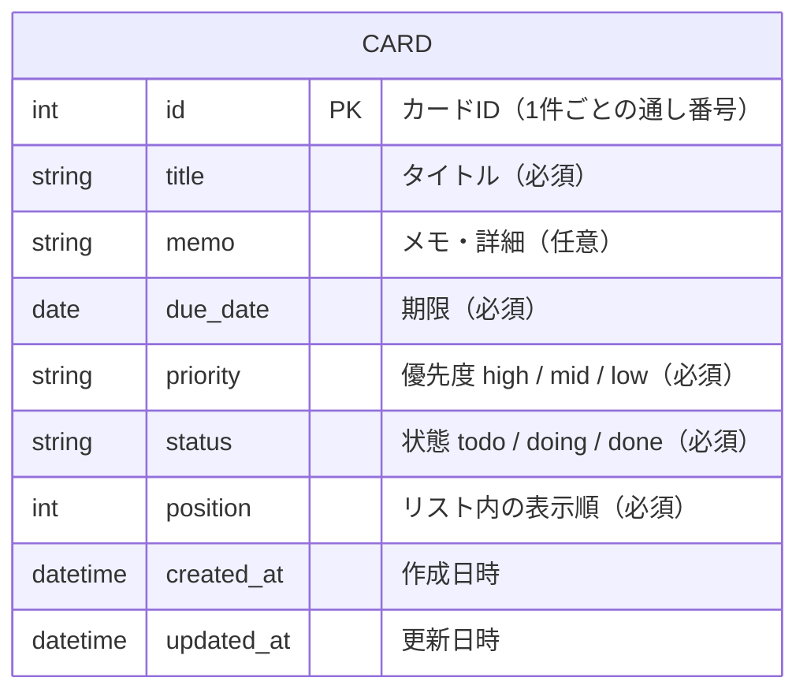

# データ設計 — マイTODOボード

> 親ドキュメント：[要件定義書](requirements.md)

データはブラウザの localStorage ではなく、**データベース（DB）に保存**する。
タスクは「カード（CARD）」という1つの表で管理し、未着手・作業中・完了の区別は
カードが持つ **status（状態）** の値で表す。

## 1. ER図

## 2. テーブル定義：CARD（カード）

カード1件が、表の1行（1レコード）になる。

| カラム（項目） | 型 | 必須 | 説明 | 例 |
|---|---|---|---|---|
| id | INTEGER | 必須(PK) | カードを見分ける通し番号。重複しない | 1 |
| title | VARCHAR | 必須 | タイトル | "買い物に行く" |
| memo | TEXT | 任意 | メモ・詳細 | "牛乳と卵を買う" |
| due_date | DATE | 必須 | 期限 | "2026-06-10" |
| priority | VARCHAR | 必須 | 優先度（high / mid / low） | "high" |
| status | VARCHAR | 必須 | 状態（todo / doing / done）。どのリストに表示するかを決める | "todo" |
| position | INTEGER | 必須 | リスト内での表示順。数が小さいほど上に表示する。手動並び替えの順番を保持するために使う | 0 |
| created_at | DATETIME | 必須 | 作成日時 | "2026-06-08 10:00" |
| updated_at | DATETIME | 必須 | 更新日時 | "2026-06-08 12:30" |

> **PK（主キー）** … 1件1件を見分けるための番号（出席番号のようなもの）。PostgreSQL では新しいカードを追加するたびに自動で連番が振られる。
> **status** … この値が `todo` なら「未着手」、`doing` なら「作業中」、`done` なら「完了」の列に表示する。
> **position** … 同じ status（同じリスト）の中で、上から何番目に並べるかを表す。手動で並び替えた順番をそのまま覚えておくために使う。

## 3. データの中身のイメージ

CARD テーブルにデータが並ぶイメージ：

| id | title | due_date | priority | status |
|---|---|---|---|---|
| 1 | 買い物に行く | 2026-06-10 | high | todo |
| 2 | 資料作成 | 2026-06-09 | mid | doing |
| 3 | 部屋の掃除 | 2026-06-08 | low | done |

## 4. データの流れ

各操作とDBへの処理の対応は以下の通り。

| 操作（ユースケース） | DBへの処理 |
|---|---|
| ボード表示（UC-06） | カードを全件読み込み、status ごとに各リストへ振り分けて表示（SELECT） |
| カード追加（UC-01） | カードを1件登録（INSERT） |
| カード編集（UC-02） | カードの内容を更新（UPDATE） |
| カード削除（UC-03） | カードを1件削除（DELETE） |
| カード移動（UC-04） | カードの `status` を移動先の値に更新（UPDATE）。落とした位置に応じて `position` も更新する |
| 手動並び替え（UC-05） | カードの `position` を新しい並び順に合わせて更新（UPDATE） |
| 自動整列（UC-05） | 取得したカードを期限順／優先度順に並べて表示 |
