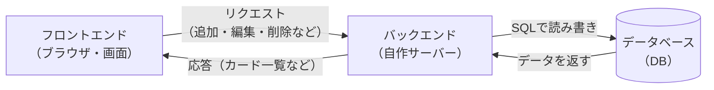
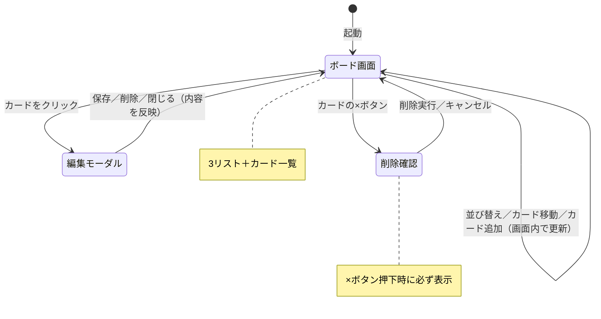
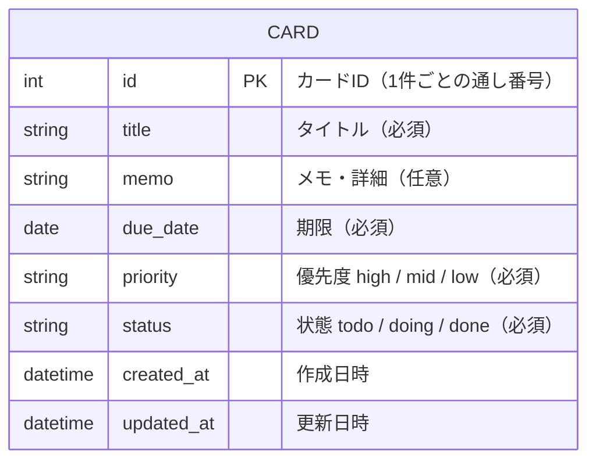

# 要件定義書 — マイTODOボード（Trello風タスク管理アプリ）

| 項目 | 内容 |
|---|---|
| ドキュメント名 | マイTODOボード 要件定義書 |
| バージョン | 1.0 |
| 作成日 | 2026-06-08 |
| 区分 | スクール課題 / 学習用 |

---

## 1. 目的・背景

- IT 未経験者が、AI を活用しながらアプリ開発の一連の流れ（要件定義 → 設計 → 実装）を学ぶことを目的とする。
- 題材として、Trello に代表される「カンバン方式」のタスク管理アプリを、必要最小限の機能で作成する。
- 自分のタスクを「未着手 → 作業中 → 完了」と視覚的に動かして管理できることを目指す。

## 2. 対象ユーザー

- 利用者：本人一人（個人利用）
- 利用環境：PC のブラウザ（Chrome など）
- 複数人での共有・チーム利用は想定しない。

## 3. 用語定義

| 用語 | 意味 |
|---|---|
| ボード | アプリ全体の作業領域。本アプリでは1枚固定。 |
| リスト（列） | ボード上に縦に並ぶタスクの分類。「未着手」「作業中」「完了」の3つ。 |
| カード | 1件のタスク。リストの中に並ぶ。 |

## 4. 機能要件

### 4.1 機能一覧

| No | 機能 | 概要 | 優先度 |
|---|---|---|---|
| F-01 | カード追加 | タイトル・期限・優先度を入力してカードを新規作成する | 必須 |
| F-02 | カード削除 | カードを削除する | 必須 |
| F-03 | カード編集 | タイトル・メモ・期限・優先度を編集する | 必須 |
| F-04 | カード移動 | ドラッグ＆ドロップでカードを別のリストへ移動する | 必須 |
| F-05 | データ保存 | リロード・再訪問してもデータが残る | 必須 |
| F-06 | 並び替え | リスト内のカードを「期限順」「優先度順」で並び替える | 必須 |

### 4.2 機能詳細

#### F-01 カード追加
- 各リストの「＋ カードを追加」を押すと入力欄が開く。
- タイトル・期限・優先度を入力して追加する（メモは後から編集）。
- タイトル・期限・優先度は必須。未入力のときは追加しない。

#### F-02 カード削除
- カード上の削除ボタン（×）を押すと、削除確認ダイアログを表示する。
- 編集モーダル内の「削除」ボタンから削除する場合も、同じ確認ダイアログを表示する。
- 誤操作を防ぐため、削除前の確認は**毎回必ず表示する（必須）**。
- ダイアログで「削除」を選んだときのみ削除し、「キャンセル」を選んだときは何もしない。

#### F-03 カード編集
- カードをクリックすると編集画面（モーダル）が開く。
- 編集できる項目：
  - タイトル（必須・文字）
  - メモ・詳細（任意・複数行の文字）
  - 期限（必須・日付）
  - 優先度（必須・「高」「中」「低」から選択）
- 保存するとカード表示に反映される。

#### F-04 カード移動
- カードをドラッグして別のリストへドロップすると、そのリストへ移動する。
- 移動先のリストにハイライト表示をして分かりやすくする。

#### F-05 データ保存
- データはバックエンド（サーバー）経由でデータベース（DB）に保存する。
- アプリを開いたとき、DB から保存済みデータを読み込んで表示する。

#### F-06 並び替え
- リストごとに並び替えの基準を選べる。
  - 期限順（早い順）
  - 優先度順（高 → 中 → 低）

## 5. ユースケース

利用者（本人）がアプリで行う操作を整理する。アクターは「利用者」1名のみ。

### 5.1 ユースケース図

```
        ┌─────────────────────────────────┐
        │        マイTODOボード             │
        │                                  │
        │   ( UC-01 カードを追加する )       │
        │   ( UC-02 カードを編集する )       │
利用者 ──┤   ( UC-03 カードを削除する )       │
 (●人)  │   ( UC-04 カードを移動する )       │
        │   ( UC-05 カードを並び替える )      │
        │   ( UC-06 ボードを表示する )       │
        │                                  │
        └─────────────────────────────────┘
```

### 5.2 ユースケース詳細

| ID | ユースケース | 概要 | 事前条件 | 基本の流れ | 事後条件 |
|---|---|---|---|---|---|
| UC-01 | カードを追加する | 新しいタスクを登録する | ボード表示中 | ①「＋カードを追加」を押す ②タイトル・期限・優先度を入力 ③追加を押す | 対象リストにカードが1件増える |
| UC-02 | カードを編集する | タスクの内容を変更する | カードが存在する | ①カードをクリック ②モーダルで内容を編集 ③保存を押す | 変更がカード表示に反映される |
| UC-03 | カードを削除する | 不要なタスクを消す | カードが存在する | ①削除ボタン（×）を押す ②確認ダイアログで「削除」を押す | カードが消える |
| UC-04 | カードを移動する | タスクの状態を変える | カードが存在する | ①カードを別リストへドラッグ＆ドロップ | カードが移動先リストへ移る |
| UC-05 | カードを並び替える | 見やすい順に整える | カードが2件以上ある | ①並び替え基準を選ぶ | リスト内のカード順が変わる |
| UC-06 | ボードを表示する | 保存済みタスクを見る | ― | ①アプリを開く | DB に保存された内容が画面に表示される |

## 6. 非機能要件

| 項目 | 内容 |
|---|---|
| 動作環境（画面側） | モダンブラウザ（Chrome / Edge / Safari の最新版） |
| 構成 | フロントエンド（ブラウザ）＋ 自作バックエンド（サーバー）＋ データベース（DB）の3層構成 |
| データ保存先 | データベース（DB）に保存（種類は実装時に決定） |
| 性能 | 個人利用想定のため特別な性能要件はなし |
| セキュリティ | 学習用のため認証は行わない。バックエンドとDBはローカル環境で動作させる |

## 7. システム構成・技術選定

### 7.1 システム構成

ブラウザ（フロントエンド）から、自作のバックエンド（サーバー）を通じて
データベース（DB）にデータを読み書きする3層構成とする。



### 7.2 技術選定

| 区分 | 採用技術 | 選定理由 |
|---|---|---|
| フロントエンド | HTML + CSS + JavaScript（バニラJS） | Web の基礎を身につけるため。画面の表示と操作を担当する。 |
| UI | 標準DOM + CSS | 小規模なため追加ライブラリは不要。レイアウトは CSS Flexbox / Grid で構成。 |
| ドラッグ＆ドロップ | HTML5 Drag and Drop API（標準機能） | 外部ライブラリなしでカード移動を実現できる。 |
| バックエンド | 自作のサーバー（言語・フレームワークは実装時に決定） | フロントとDBの仲介役。データの保存・取得の処理を担当する。 |
| データ保存 | データベース（DB）（種類は実装時に決定） | データを端末に依存せず永続的に保存できる。 |
| 通信方式 | フロント ⇄ バックエンド間で HTTP（API）でやり取り | 画面とサーバーを分けて作るための一般的な方式。 |
| 開発ツール | ブラウザ + テキストエディタ（VS Code） | 環境構築が最小限で済む。 |

> 補足：バックエンドの言語・フレームワークやDBの種類は、本書の段階では未定とし、実装時に決定する。

## 8. 画面イメージ

```
┌─────────────────────────────────────────────┐
│ 📋 マイTODOボード                              │
├──────────────┬──────────────┬───────────────┤
│   未着手      │   作業中      │    完了        │
│ [並び替え ▼] │ [並び替え ▼] │ [並び替え ▼]  │
│ ┌──────────┐ │ ┌──────────┐ │               │
│ │ 買い物  ×│ │ │ 資料作成×│ │               │
│ │ 🔴高 6/10│ │ │ 🟡中 6/9 │ │               │
│ └──────────┘ │ └──────────┘ │               │
│ ＋ カード追加 │ ＋ カード追加 │ ＋ カード追加  │
└──────────────┴──────────────┴───────────────┘

カードをクリックすると編集モーダルが開く：
┌──────────────────────┐
│ タイトル: [________]  │
│ メモ    : [________]  │
│ 期限    : [____/__/__]│
│ 優先度  : (高)(中)(低)│
│      [保存] [削除]    │
└──────────────────────┘

カードの×ボタンを押すと、削除確認ダイアログが必ず表示される：
┌────────────────────────────┐
│ ⚠️ カードの削除              │
│                            │
│ 「買い物に行く」を           │
│ 削除してもよろしいですか？     │
│ （この操作は取り消せません）   │
│                            │
│     [キャンセル]  [削除]     │
└────────────────────────────┘
```

## 9. 画面遷移図

本アプリは「ボード画面」を中心とし、編集時にモーダルが開く構成。画面数は少なくシンプル。



### 画面遷移の説明

| 遷移元 | 操作 | 遷移先 |
|---|---|---|
| ① ボード画面 | カードをクリック | ② 編集モーダル |
| ② 編集モーダル | 保存 / 削除 / 閉じる | ① ボード画面（内容を反映） |
| ① ボード画面 | カードの×ボタン | ③ 削除確認（必ず表示）→ ① へ戻る |
| ① ボード画面 | 並び替え・ドラッグ移動・カード追加 | 画面遷移なし（① の中で表示更新） |

## 10. データ設計

データはブラウザの localStorage ではなく、**データベース（DB）に保存**する。
タスクは「カード（CARD）」という1つの表で管理し、未着手・作業中・完了の区別は
カードが持つ **status（状態）** の値で表す。

### 10.1 ER図



### 10.2 テーブル定義：CARD（カード）

カード1件が、表の1行（1レコード）になる。

| カラム（項目） | 型 | 必須 | 説明 | 例 |
|---|---|---|---|---|
| id | INTEGER | 必須(PK) | カードを見分ける通し番号。重複しない | 1 |
| title | VARCHAR | 必須 | タイトル | "買い物に行く" |
| memo | TEXT | 任意 | メモ・詳細 | "牛乳と卵を買う" |
| due_date | DATE | 必須 | 期限 | "2026-06-10" |
| priority | VARCHAR | 必須 | 優先度（high / mid / low） | "high" |
| status | VARCHAR | 必須 | 状態（todo / doing / done）。どのリストに表示するかを決める | "todo" |
| created_at | DATETIME | 必須 | 作成日時 | "2026-06-08 10:00" |
| updated_at | DATETIME | 必須 | 更新日時 | "2026-06-08 12:30" |

> **PK（主キー）** … 1件1件を見分けるための番号（出席番号のようなもの）。
> **status** … この値が `todo` なら「未着手」、`doing` なら「作業中」、`done` なら「完了」の列に表示する。

### 10.3 データの中身のイメージ

CARD テーブルにデータが並ぶイメージ：

| id | title | due_date | priority | status |
|---|---|---|---|---|
| 1 | 買い物に行く | 2026-06-10 | high | todo |
| 2 | 資料作成 | 2026-06-09 | mid | doing |
| 3 | 部屋の掃除 | 2026-06-08 | low | done |

### 10.4 データの流れ

各操作とDBへの処理の対応は以下の通り。

| 操作（ユースケース） | DBへの処理 |
|---|---|
| ボード表示（UC-06） | カードを全件読み込み、status ごとに各リストへ振り分けて表示（SELECT） |
| カード追加（UC-01） | カードを1件登録（INSERT） |
| カード編集（UC-02） | カードの内容を更新（UPDATE） |
| カード削除（UC-03） | カードを1件削除（DELETE） |
| カード移動（UC-04） | カードの `status` を移動先の値に更新（UPDATE） |
| 並び替え（UC-05） | 取得したカードを期限順／優先度順に並べて表示 |

## 11. 対象外（今回やらないこと）

将来の拡張候補として記録しておく。

- 担当者の割り当て
- 添付ファイル
- 複数ボードの切り替え
- リストの追加 / 名前変更（リストは3つ固定）
- チーム共有・ログイン / 認証
- DBやバックエンドのサーバー公開（クラウドへのデプロイ。本課題ではローカル環境で動作）

## 12. 今後の進め方（参考）

1. 要件定義（本書）✅
2. 画面・データ・API の設計（DBのテーブル、バックエンドの処理を具体化）
3. 実装
   - フロントエンド（HTML / CSS / JavaScript）
   - バックエンド（サーバー）＋ データベース（DB）
4. フロントとバックエンドをつないで動作確認
5. 余裕があれば拡張（期限が近いカードを強調、など）
