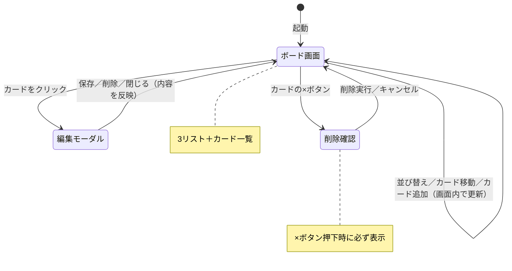

# 画面設計 — マイTODOボード

> 親ドキュメント：[要件定義書](requirements.md)

## 1. 画面イメージ

```
┌─────────────────────────────────────────────┐
│ 📋 マイTODOボード                              │
├──────────────┬──────────────┬───────────────┤
│   未着手      │   作業中      │    完了        │
│ [並び替え ▼] │ [並び替え ▼] │ [並び替え ▼]  │
│ ┌──────────┐ │ ┌──────────┐ │               │
│ │ 買い物  ×│ │ │ 資料作成×│ │               │
│ │ 🔴高 6/10│ │ │ 🟡中 6/9 │ │               │
│ └──────────┘ │ └──────────┘ │               │
│ ＋ カード追加 │ ＋ カード追加 │ ＋ カード追加  │
└──────────────┴──────────────┴───────────────┘

カードをクリックすると編集モーダルが開く：
┌──────────────────────┐
│ タイトル: [________]  │
│ メモ    : [________]  │
│ 期限    : [____/__/__]│
│ 優先度  : (高)(中)(低)│
│      [保存] [削除]    │
└──────────────────────┘

カードの×ボタンを押すと、削除確認ダイアログが必ず表示される：
┌────────────────────────────┐
│ ⚠️ カードの削除              │
│                            │
│ 「買い物に行く」を           │
│ 削除してもよろしいですか？     │
│ （この操作は取り消せません）   │
│                            │
│     [キャンセル]  [削除]     │
└────────────────────────────┘
```

## 2. 画面遷移図

本アプリは「ボード画面」を中心とし、編集時にモーダルが開く構成。画面数は少なくシンプル。



### 画面遷移の説明

| 遷移元 | 操作 | 遷移先 |
|---|---|---|
| ① ボード画面 | カードをクリック | ② 編集モーダル |
| ② 編集モーダル | 保存 / 削除 / 閉じる | ① ボード画面（内容を反映） |
| ① ボード画面 | カードの×ボタン | ③ 削除確認（必ず表示）→ ① へ戻る |
| ① ボード画面 | 並び替え・ドラッグ移動・カード追加 | 画面遷移なし（① の中で表示更新） |
