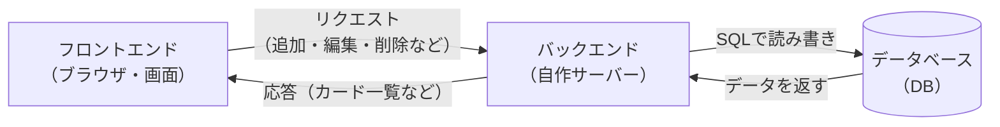

# システム構成・技術選定・非機能要件 — マイTODOボード

> 親ドキュメント：[要件定義書](requirements.md)

## 1. 非機能要件

| 項目 | 内容 |
|---|---|
| 動作環境（画面側） | モダンブラウザ（Chrome / Edge / Safari の最新版） |
| 構成 | フロントエンド（ブラウザ）＋ 自作バックエンド（サーバー）＋ データベース（DB）の3層構成 |
| データ保存先 | データベース（DB）に保存（種類は実装時に決定） |
| 性能 | 個人利用想定のため特別な性能要件はなし |
| セキュリティ | 学習用のため認証は行わない。バックエンドとDBはローカル環境で動作させる |

## 2. システム構成

ブラウザ（フロントエンド）から、自作のバックエンド（サーバー）を通じて
データベース（DB）にデータを読み書きする3層構成とする。

## 3. 技術選定

| 区分 | 採用技術 | 選定理由 |
|---|---|---|
| フロントエンド | HTML + CSS + JavaScript（バニラJS） | Web の基礎を身につけるため。画面の表示と操作を担当する。 |
| UI | 標準DOM + CSS | 小規模なため追加ライブラリは不要。レイアウトは CSS Flexbox / Grid で構成。 |
| ドラッグ＆ドロップ | HTML5 Drag and Drop API（標準機能） | 外部ライブラリなしでカード移動を実現できる。 |
| バックエンド | 自作のサーバー（言語・フレームワークは実装時に決定） | フロントとDBの仲介役。データの保存・取得の処理を担当する。 |
| データ保存 | データベース（DB）（種類は実装時に決定） | データを端末に依存せず永続的に保存できる。 |
| 通信方式 | フロント ⇄ バックエンド間で HTTP（API）でやり取り | 画面とサーバーを分けて作るための一般的な方式。 |
| 開発ツール | ブラウザ + テキストエディタ（VS Code） | 環境構築が最小限で済む。 |

> 補足：バックエンドの言語・フレームワークやDBの種類は、本書の段階では未定とし、実装時に決定する。
