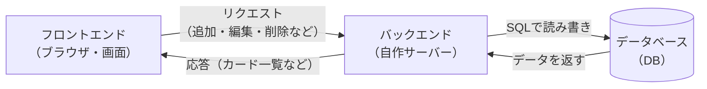

# システム構成・技術選定・非機能要件 — マイTODOボード

> 親ドキュメント：[要件定義書](requirements.md)

## 1. 非機能要件

| 項目 | 内容 |
|---|---|
| 動作環境（画面側） | モダンブラウザ（Chrome / Edge / Safari の最新版） |
| 構成 | フロントエンド（ブラウザ）＋ 自作バックエンド（サーバー）＋ データベース（DB）の3層構成 |
| データ保存先 | データベース（DB）に保存（種類は実装時に決定） |
| 性能 | 個人利用想定のため特別な性能要件はなし |
| セキュリティ | 学習用のため認証は行わない。バックエンドとDBはローカル環境で動作させる |

## 2. システム構成

ブラウザ（フロントエンド）から、自作のバックエンド（サーバー）を通じて
データベース（DB）にデータを読み書きする3層構成とする。

## 3. 技術選定

### 3.1 フロントエンド（画面側）

| 区分 | 採用技術 | 選定理由 |
|---|---|---|
| 言語 | TypeScript | JavaScript に「型（データの種類のルール）」を足したもの。打ち間違いや勘違いによるバグに気づきやすく、実務でも主流。 |
| フレームワーク | React（Next.js は不使用） | 画面を「部品（コンポーネント）」に分けて作れる定番ライブラリ。カードやリストを部品として扱える。 |
| ビルドツール | Vite | React アプリを動かす・まとめるための道具。開発用サーバの起動が速く、Next を使わない React 構成の標準的な選択。 |
| 通信 | fetch（ブラウザ標準） | バックエンドの API に HTTP でリクエストを送り、JSON でデータをやり取りする。標準機能のため追加部品が不要。 |
| ドラッグ＆ドロップ | @dnd-kit | カードの移動・並び替えを安定して実装できる React 用ライブラリ。 |
| スタイル | CSS / CSS Modules | 小規模なため追加 UI ライブラリは不要。レイアウトは Flexbox / Grid で構成。 |

### 3.2 バックエンド（サーバー側）

| 区分 | 採用技術 | 選定理由 |
|---|---|---|
| 言語 | Java 25（最新LTS） | 長期サポート版（LTS）で安定して使える。サーバー開発の定番言語。 |
| フレームワーク | Spring Boot 4.0 | Java でサーバーを効率よく作るための定番フレームワーク。 |
| Web 機能（API） | Spring Web | ブラウザ（React）からのリクエストを受け取る窓口（API）を作る部品。 |
| ビルドツール | Gradle | 必要な部品（依存関係）の取得やビルドを自動化する道具。 |
| DB アクセス | Spring Data JPA（Hibernate） | Java のコードでデータベースの読み書き（CRUD）を簡潔に書ける。 |
| DB ドライバ | PostgreSQL JDBC Driver | Java から PostgreSQL に接続するための「通訳」部品。 |
| 入力チェック | Spring Validation | タイトル・期限・優先度などの必須入力チェックを行う部品。 |
| テスト | JUnit 5 + Spring Boot Test | Spring Boot に同梱される標準のテスト用ツール。 |

### 3.3 データベース・開発環境

| 区分 | 採用技術 | 選定理由 |
|---|---|---|
| データベース | PostgreSQL | データを端末に依存せず永続的に保存できる定番のリレーショナルDB。 |
| 通信方式 | フロント ⇄ バックエンド間で HTTP（REST API・JSON） | 画面とサーバーを分けて作るための一般的な方式。 |
| 開発ツール | VS Code ＋ JDK（Java）＋ Node.js（React） | フロント・バックエンド双方の開発に必要な基本ツール。 |

> 補足：PostgreSQL の起動方法（Docker / ローカルインストール）と、テーブル（スキーマ）の管理方法（Flyway / JPA の自動生成）は本書では保留とし、実装時に決定する。
